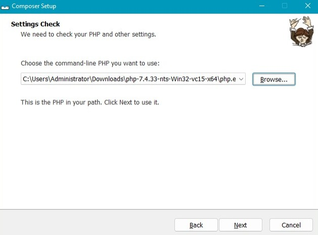
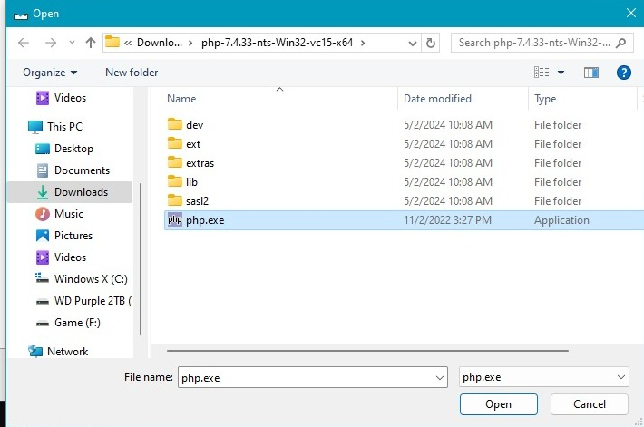

<h1 align="center">Setup Laravel 8 Guide</h1>

<p align="center">
    <a href="README.id.md">Indonesia</a> | <a href="../README.md">English</a>
</p>

<h3 align="center">Cara setup `Laravel 8`</h3>

Mungkin masih banyak yang bingung cara install `laravel 8` dikarenakan mungkin uda agak lama versinya

## Tutorial

### Clone Repo Ini

```bash
git clone https://github.com/rynnxz/laravel-8.git
```

### Ekstrak file PHP
Ekstrak file `php-7.4.33-nts-Win32-vc15-x64.zip` atau `php-7.4.33-nts-Win32-vc15-x86.zip` kalian pilih sesuai dengan berapa bit OS windows kalian, atau download dari <a href="https://php.watch/versions/7.4/releases/7.4.33">Download PHP Versi 7.4.33</a>, bebas mo ekstrak dimana

### Install Composer
Kemudian install `Composer-Setup.exe` tinggal kalian next saja, lalu jika diminta file PHPnya, seperti gambar dibawah ini


<p>kalian arahkan ke file yang kalian ekstrak tadi, misalnya di Download</p>


<p>kemudian next terus</p>

## Laravel Install Guide
### Buka Command Prompt / Terminal / yang lainnya terserah kalian
Setelah dibuka coba arahkan Terminal tersebut ke-directory project kalian, atau simpelnya dimana kalian ingin simpan project laravelnya, misalnya di `E:\rynn\laravel` ini kalau dari gw

``` bash
cd E:\rynn\laravel
e:
```

### Command untuk Install laravelnya
<p>Nah jika sudah diarahkan ke directory yang kalian inginkan kemudian jalankan command berikut</p>

```bash
composer create-project laravel/laravel:^8.0 contoh-app
```

<p>Kemudian tunggu downloadingnya selesai</p>

### Jalankan Laravelnya
Untuk menguji apakah laravelnya sudah terinstall dengan baik, coba masuk ke file yang kalian buat tadi, klo gw kan `contoh-app`, berarti tinggal

```bash
cd contoh-app
```

<p>kemudian jalankan perintah</p>

```bash
php artisan serve
```

nah nanti bakalan ada berupa IP `http://127.0.0.1:8000` dan coba kalian buka di Browser

<h1 align="center">SELAMAT LARAVEL KALIAN SUDAH TERINSTAL!</h1>
